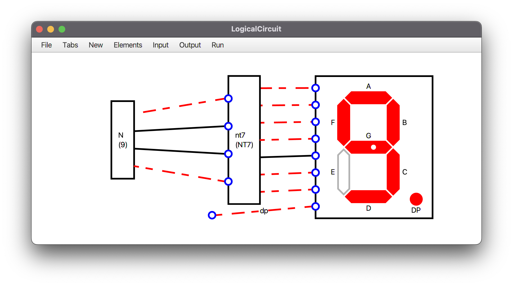
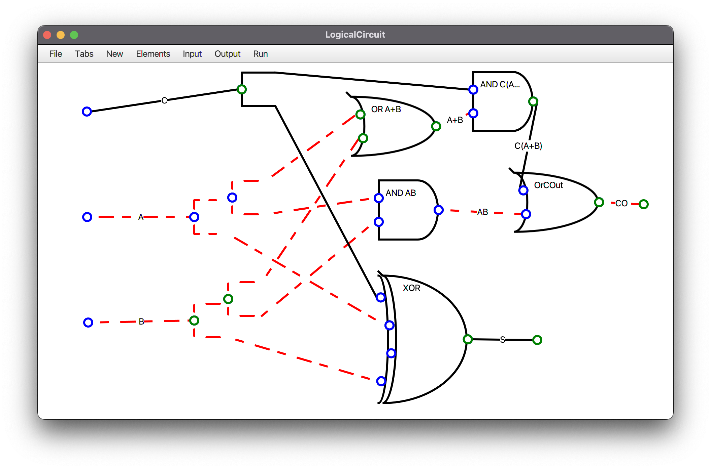
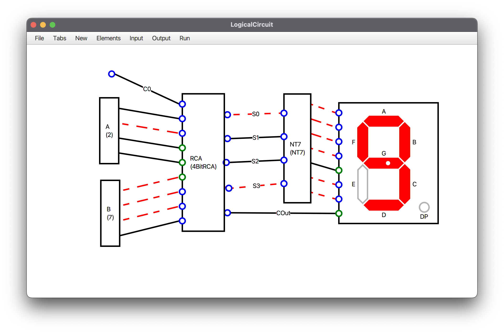

# LogicalCircuitEmulator
LogicalCircuitEmulator is an open-source CAD tool for logic circuits written in java (JavaFX).  

- Supports all basic gates such as AND, OR, XOR, NOT, NAND, NOR, XNOR.
- Supports Seven Segment
- Supports Latch And Flip-Flop (Both Positive and Negative)
- Generates Truth Table
- You can create new Modules
- Save your project and reload it from a `.circuit` file

 

## Basic Gates

<b>AND</b>

> The AND gate is a basic digital logic gate that implements logical conjunction (∧) from mathematical logic – AND gate behaves according to the truth table. A HIGH output (1) results only if all the inputs to the AND gate are HIGH (1). If not all inputs to the AND gate are HIGH, LOW output results. The function can be extended to any number of inputs. [Read More...](https://en.wikipedia.org/wiki/AND_gate)

<b>OR</b>

> The OR gate is a digital logic gate that implements logical disjunction. The OR gate returns true if either or both of its inputs are true; otherwise it returns false. The input and output states are normally represented by different voltage levels. [Read More...](https://en.wikipedia.org/wiki/OR_gate)

<b>XOR</b>

> XOR gate (sometimes EOR, or EXOR and pronounced as Exclusive OR) is a digital logic gate that gives a true (1 or HIGH) output when the number of true inputs is odd. An XOR gate implements an exclusive; that is, a true output results if one, and only one, of the inputs to the gate is true. [Read More...](https://en.wikipedia.org/wiki/XOR_gate)

<b>NOT</b>

> In digital logic, an inverter or NOT gate is a logic gate which implements logical negation. It outputs a bit opposite of the bit that is put into it. The bits are typically implemented as two differing voltage levels. [Read More...](https://en.wikipedia.org/wiki/Inverter_(logic_gate))

<b>NAND</b>

> In digital electronics, a NAND gate (NOT-AND) is a logic gate which produces an output which is false only if all its inputs are true. NAND is the result of the negation of the AND operator. [Read More...](https://en.wikipedia.org/wiki/NAND_gate)

<b>NOR</b>

> The NOR gate is a digital logic gate that implements logical NOR - it behaves according to the truth table. A HIGH output (1) results if both the inputs to the gate are LOW (0); if one or both input is HIGH (1), a LOW output (0) results. NOR is the result of the negation of the OR operator. [Read More...](https://en.wikipedia.org/wiki/NOR_gate)

<b>XNOR</b>

> The XNOR gate is a digital logic gate whose function is the logical complement of the Exclusive OR (XOR) gate. The two-input version implements logical equality, behaving according to the truth table, and hence the gate is sometimes called an "equivalence gate". A high output (1) results if both of the inputs to the gate are the same. If one but not both inputs are high (1), a low output (0) results. XNOR is the result of the negation of the XOR operator. [Read More...](https://en.wikipedia.org/wiki/XNOR_gate)

## Truth Table

Generate Truth-Table from File -> Truth Table

## Seven-Segment Display
> A seven-segment display is a form of electronic display device for displaying decimal numerals. [Read More...](https://en.wikipedia.org/wiki/Seven-segment_display)

Seven-segment gets 8 inputs: 7 bit for each line in module and last bit for DP. 
Input order: [A, B, C, D, E, F, G, DP]

There is a module named `Number`, You can enter count of bits you want and the number that it should show. 
It doesn't get any inputs but it will give you N-Bit output that displays the number you want. 
You can update the number later in Elements -> [Number element name] -> Update Number. 

And another module named `NumberTo7Segment (NT7)`, 
Which gets 4 input as a BCD number and returns 7 outputs to simply display the number on Seven-segment.

## Latch & Flip-Flop
> flip-flop or latch is a circuit that has two stable states and can be used to store state information [Read More...](https://en.wikipedia.org/wiki/Flip-flop_(electronics))

You are not allowed to create a loop in circuit, but you can use the predefined `D-Latch`, `D-FlipFlop` and `T-FlipFlop` modules.

## Save And Reload

You can Save a `.circuit` file from File -> Save, and reload it later from File -> Load.  
When you save a tab (module), all custom modules used in it will also be saved in the output file.  
I've saved some sample circuits and modules in [MyModules](./MyModules), Try them :)

## Create New Module

1. Create a new tab from Tabs -> New Tab
2. Enter the name of tab (Module)
3. Design your module circuit  
 You can see the order of inputs and outputs from Input and Output tabs. 
 By default the order is the same as you add wires to the circuit. 
 You can change the order by sending wire to back or bring it to front from Elements -> [WireName] 
4. Back to your main tab from Tabs -> [Main tab name]
5. Add your module to the circuit from New -> Module -> My Modules -> [Your Module Name]

## FullAdder and 4-Bit RCA Modules!

**Step 1: Create a new module named FullAdder.**  
FullAdder must get 3 inputs in order of [C, A, B] and returns 2 outputs in order of [CO, S]. 
S  = A ⊕ B ⊕ C  
CO = C(A + B) + AB  
The designed circuit: [FullAdder.circuit](./MyModules/FullAdder.circuit)  

**Step 2: Create a new module named 4BitRCA.**  
4BitRCA must get 9 inputs in order of [C, A0, A1, A2, A3, B0, B1, B2, B3] and returns 5 outputs in order of [S0, S1, S2, S3, COut] 
The module must contains four FullAdders. input [Ci, Ai, Bi] to get [Si, C(i+1)].  
The designed circuit: [4BitRCA.circuit](./MyModules/4BitRCA.circuit)  

**Step 3: Create a new module named Number4BitRCA.**  
*You can simplify 4BitRCA if and only if you have ordered the inputs correctly!*  
Simplify Ai and Bi with two `Number` module.  
Connect Si wires to a `NumberToSevenSegment (NT7)` module.  
Add a `Seven-Segment` to circuit and connect NT7 to seven-segment.  
Connect COut to Seven-segment's DP input.  
Example: If you set the number of A to 2 and B to 7. The output `S` must show number 9 in seven-segment.  
The designed circuit: [Number4BitRCA.circuit](./MyModules/Number4BitRCA.circuit)  

License
=======

    Copyright 2022 Amir Hossein Aghajari
    Licensed under the Apache License, Version 2.0 (the "License");
    you may not use this file except in compliance with the License.
    You may obtain a copy of the License at

       http://www.apache.org/licenses/LICENSE-2.0

    Unless required by applicable law or agreed to in writing, software
    distributed under the License is distributed on an "AS IS" BASIS,
    WITHOUT WARRANTIES OR CONDITIONS OF ANY KIND, either express or implied.
    See the License for the specific language governing permissions and
    limitations under the License.

  

  
   <a>Amir Hossein Aghajari</a> • <a href="mailto:amirhossein.aghajari.82@gmail.com">Email</a> • <a href="https://github.com/Aghajari">GitHub</a>

